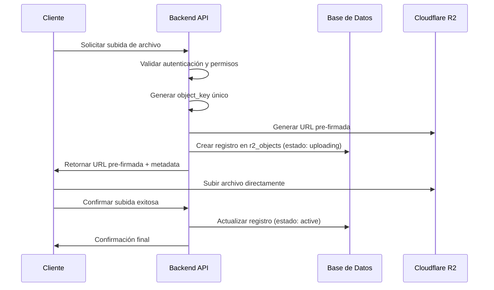

# Planificación de Seguridad y Arquitectura para R2 Buckets por Organización

## 1. Arquitectura Multi-Tenant con R2

### 1.1. Estrategia de Nomenclatura de Buckets

Para garantizar un aislamiento claro y evitar tanto colisiones de nombres como la predictibilidad, los buckets se nombrarán utilizando una combinación de un prefijo, el `organizationId` y un componente pseudoaleatorio. Esto ofusca el nombre del bucket, impidiendo que actores maliciosos puedan adivinarlo.

- **Formato Sugerido:** `org-[organizationId]-[uuid]`
- **Ejemplo:** `org-12345-a4e8f8b2-9b6b-4a5c-8e1a-3d9f4c1b0e2d`

**Implementación:**
- Al crear una nueva organización, genera un `UUIDv4`.
- Almacena el nombre completo del bucket (`org-[organizationId]-[uuid]`) en la base de datos de tu aplicación, asociado a la organización correspondiente. Este nombre será utilizado por la aplicación para interactuar con la API de Cloudflare R2.

### 1.2. Aislamiento de Datos por Organización

Cada organización tendrá su propio bucket de R2, lo que garantiza un aislamiento completo de los datos a nivel de infraestructura. El acceso a cada bucket estará estrictamente controlado por el `organizationId` y el nombre único del bucket.

## 2. Gestión de Acceso y Permisos

### 2.1. Autenticación y Autorización

El acceso a los buckets de R2 se gestionará a través de la API de Cloudflare, utilizando tokens de API con permisos específicos. La aplicación actuará como un intermediario, validando las solicitudes de los usuarios y generando tokens de acceso con alcance limitado según sea necesario.

### 2.2. Tokens de Acceso con Alcance (Scoped Access Tokens)

Para operaciones específicas (por ejemplo, carga o descarga de un archivo), la aplicación generará tokens de API de Cloudflare con alcance limitado que solo otorgan los permisos necesarios para esa operación en un objeto específico.

- **Permisos:** `r2:object:read`, `r2:object:write`, `r2:object:delete`
- **Recurso:** `arn:aws:s3:::org-[organizationId]-[uuid]/[filePath]`

### 2.3. Políticas de Acceso a Nivel de Bucket

Se configurarán políticas de acceso a nivel de bucket para denegar el acceso público por defecto. Solo se permitirá el acceso a través de solicitudes autenticadas y autorizadas por la aplicación.

## 3. Seguridad de los Datos

### 3.1. Cifrado en Reposo y en Tránsito

- **En Tránsito:** Todo el tráfico hacia y desde R2 se realizará a través de HTTPS (TLS), garantizando que los datos estén cifrados durante la transferencia.
- **En Reposo:** Cloudflare R2 cifra automáticamente todos los los datos en reposo sin costo adicional.

### 3.2. Firmas de URL para Acceso Temporal

Para permitir que los usuarios finales accedan a los archivos de forma segura (por ejemplo, para ver un PDF), la aplicación generará URLs prefirmadas con un tiempo de vida corto (por ejemplo, 5 minutos). Esto evita la exposición de los archivos a accesos no autorizados.

### 3.3. Prevención de Fugas de Datos (DLP)

Se pueden implementar reglas de Cloudflare DLP para escanear archivos en busca de información sensible antes de que se carguen en R2, aunque esto puede tener implicaciones de costo y rendimiento.

## 4. Subida y Acceso Seguro a Archivos

### 4.1. Flujo de Carga Segura de Archivos (Upload)

1.  **Solicitud del Cliente:** El usuario, a través del cliente (navegador o aplicación móvil), indica que desea subir un archivo.
2.  **Autenticación y Autorización en tu Backend:** Tu aplicación verifica la identidad del usuario y se asegura de que tiene permisos para subir archivos para su organización.
3.  **Generación de URL Pre-firmada (Pre-signed URL):**
    *   Tu backend construye el nombre del objeto (key) que tendrá el archivo en R2 (e.g., `pdfs/documento-legal-2024.pdf`).
    *   Tu backend solicita a la API de Cloudflare (o utiliza un SDK de AWS S3 compatible) la creación de una URL pre-firmada para una operación `PutObject`.
    *   Esta URL incluye credenciales de acceso temporales y tiene un tiempo de expiración corto (e.g., 5-15 minutos).
4.  **Respuesta al Cliente:** Tu backend devuelve la URL pre-firmada al cliente.
5.  **Carga Directa a R2:** El cliente utiliza esta URL para subir el archivo directamente a Cloudflare R2 mediante una petición `HTTP PUT`. La carga no pasa por tus servidores, lo que ahorra ancho de banda y recursos.
6.  **Confirmación (Opcional):** Una vez que la carga se completa, el cliente puede notificar a tu backend para que este registre la existencia del nuevo archivo en la base de datos.

### 4.2. Flujo de Acceso Seguro a Archivos (Download/View)

1.  **Solicitud del Cliente:** El usuario solicita acceso a un archivo específico.
2.  **Autenticación y Autorización en tu Backend:** Tu aplicación verifica la identidad del usuario y comprueba si tiene permisos para acceder al archivo solicitado (basado en la organización, roles, etc.).
3.  **Generación de URL Pre-firmada:**
    *   Tu backend determina el nombre del bucket y el `key` del objeto que el usuario quiere ver.
    *   Solicita a la API de Cloudflare una URL pre-firmada para una operación `GetObject`.
    *   Esta URL también tiene un tiempo de expiración muy corto (e.g., 1-5 minutos) para minimizar el riesgo de compartición no autorizada.
4.  **Respuesta al Cliente:** Tu backend devuelve la URL pre-firmada al cliente.
5.  **Acceso Directo desde R2:** El cliente (e.g., el navegador) utiliza esta URL para descargar o mostrar el archivo directamente desde Cloudflare R2.

## 5. Gestión de Uso y Límites de Tasa (Rate Limits)

En lugar de una gestión proactiva de los límites de tasa basada en el cliente, adoptaremos un enfoque de monitoreo y reacción basado en las métricas que ofrece la API de Cloudflare. El nombre único de cada bucket se almacenará en la columna `r2BucketName` de la tabla `organization`.

### 5.1. Monitoreo del Uso por Bucket

Para medir el uso del servicio R2 por parte de cada organización, se realizarán consultas periódicas a la API de Cloudflare para obtener métricas a nivel de bucket. Esto nos permite tener una visión clara del consumo de recursos (almacenamiento, número de operaciones, etc.) para cada cliente.

**Endpoint de la API a Utilizar:**

Cloudflare proporciona un endpoint para obtener métricas de un bucket específico. Aunque la documentación de la API no detalla un endpoint de "métricas" por bucket de forma explícita en los resultados de búsqueda, la funcionalidad de `Account-Level Metrics` y los `Logs` son los mecanismos recomendados para esta tarea.

- **Cloudflare Log Explorer/Logpush:** Es la herramienta más poderosa para este caso. Puedes filtrar los logs de R2 por el nombre del bucket (`bucketName`) para obtener un detalle granular de cada solicitud, incluyendo:
    - Operaciones (Read, Write, Delete)
    - Tamaño de los objetos
    - Origen de la solicitud
    - Timestamps

- **API de Métricas a Nivel de Cuenta:** La API de Cloudflare permite obtener métricas agregadas a nivel de cuenta. Aunque no desglosan por bucket directamente en un solo endpoint, se pueden usar en combinación con los logs para obtener una visión general.

### 5.2. Estrategia de Implementación

1.  **Almacenar el Nombre del Bucket:** Al crear una organización, el nombre único del bucket (`org-[organizationId]-[uuid]`) se guarda en la tabla `organization`.

2.  **Servicio de Monitoreo en el Backend:**
    *   Crear un servicio o un job programado (e.g., un cron job) que se ejecute periódicamente (e.g., cada hora o cada 24 horas).
    *   Este servicio obtendrá la lista de todas las organizaciones y sus `r2BucketName` de la base de datos.
    *   Para cada bucket, consultará los logs de Cloudflare (vía Logpush o la API de Log Explorer) para agregar las métricas de uso relevantes del último período.

3.  **Persistencia de Métricas (Opcional pero Recomendado):**
    *   Almacenar las métricas de uso agregadas en una tabla separada en tu base de datos (e.g., `r2_usage_metrics`) asociada a cada organización.
    *   Esto permite construir históricos de consumo, generar facturas, y mostrar dashboards a los clientes sin tener que consultar la API de Cloudflare en tiempo real para cada vista.

4.  **Gestión de Límites de Tasa:**
    *   Con este enfoque, la gestión de límites de tasa se vuelve reactiva. Si se detecta un uso excesivo o abusivo por parte de una organización, se pueden tomar acciones:
        *   **Notificaciones:** Enviar alertas al administrador del sistema o al cliente.
        *   **Restricción de Acceso:** Deshabilitar temporalmente la generación de URLs pre-firmadas para esa organización si el abuso persiste.
        *   **Escalado de Plan:** Invitar al cliente a actualizar su plan si su uso supera consistentemente los límites establecidos.

## 6. Gestión del Ciclo de Vida de los Datos

### 6.1. Políticas de Retención y Eliminación

Se pueden configurar políticas de ciclo de vida en los buckets de R2 para eliminar automáticamente objetos después de un período de tiempo específico, lo que ayuda a gestionar los costos de almacenamiento y cumplir con las políticas de retención de datos.

### 6.2. Versionado de Objetos

El versionado de objetos se puede habilitar en los buckets de R2 para proteger contra la eliminación o sobreescritura accidental de archivos.

## 7. Auditoría y Monitoreo

### 7.1. Registro de Actividad

Cloudflare proporciona registros de auditoría detallados para todas las operaciones de la API de R2. Estos registros se pueden integrar con un sistema de monitoreo para detectar actividades sospechosas.

### 7.2. Alertas y Notificaciones

Se pueden configurar alertas para notificar a los administradores sobre eventos de seguridad críticos, como intentos de acceso no autorizados o cambios en las políticas de los buckets.

## 8. Integración con la Aplicación

### 8.1. Flujo de Creación de Buckets

Cuando se crea una nueva organización, la aplicación realizará una llamada a la API de Cloudflare para crear un nuevo bucket de R2 con el nombre `org-[organizationId]-[uuid]`.

### 8.2. Flujo de Carga y Descarga de Archivos

1.  El usuario solicita cargar o descargar un archivo a través de la aplicación.
2.  La aplicación autentica y autoriza al usuario.
3.  La aplicación genera una URL prefirmada para la operación solicitada.
4.  El cliente del usuario utiliza la URL prefirmada para interactuar directamente con R2.

## 9. Gestión Local de Archivos y Tracking de Objetos

### 9.1. Tabla de Tracking de Archivos en R2

Para centralizar el control de acceso y facilitar la búsqueda de archivos por entidades específicas, se implementará una tabla `r2_objects` que almacenará los metadatos de cada archivo subido a R2.

#### 9.1.1. Estructura de la Tabla `r2_objects`

```sql
-- Tabla para tracking de objetos en R2
CREATE TABLE r2_objects (
  id INT AUTO_INCREMENT PRIMARY KEY,
  
  -- Identificadores del objeto en R2
  object_key VARCHAR(500) NOT NULL,           -- Key completa del objeto en R2
  object_name VARCHAR(255) NOT NULL,          -- Nombre original del archivo
  content_type VARCHAR(100) NOT NULL,         -- MIME type del archivo
  file_size BIGINT NOT NULL,                  -- Tamaño del archivo en bytes
  file_hash VARCHAR(64),                      -- Hash del archivo para integridad
  
  -- Referencias a entidades del sistema médico (opcionales)
  patient_id INT,                             -- FK a patients
  appointment_id INT,                         -- FK a appointments
  doctor_id INT,                              -- FK a doctors
  medical_service_id INT,                     -- FK a medical_services
  
  -- Referencia obligatoria a organización
  organization_id INT NOT NULL,               -- FK a organization
  
  -- Metadatos adicionales
  file_category ENUM('medical_document', 'patient_photo', 'medical_image', 'appointment_note', 'prescription', 'lab_result', 'other') NOT NULL,
  description TEXT,                           -- Descripción opcional del archivo
  tags JSON,                                  -- Etiquetas adicionales en formato JSON
  
  -- URLs de acceso temporal (cache)
  last_presigned_url TEXT,                    -- Última URL pre-firmada generada
  presigned_url_expires_at TIMESTAMP,         -- Expiración de la URL pre-firmada
  
  -- Control de acceso y estado
  is_active BOOLEAN DEFAULT true NOT NULL,    -- Estado activo del archivo
  is_public BOOLEAN DEFAULT false NOT NULL,   -- Si permite acceso público (casos especiales)
  access_level ENUM('private', 'organization', 'restricted') DEFAULT 'private' NOT NULL,
  
  -- Auditoría
  uploaded_by INT,                            -- FK a users (quien subió el archivo)
  created_at TIMESTAMP DEFAULT CURRENT_TIMESTAMP NOT NULL,
  updated_at TIMESTAMP DEFAULT CURRENT_TIMESTAMP ON UPDATE CURRENT_TIMESTAMP NOT NULL,
  deleted_at TIMESTAMP,                       -- Soft delete
  
  -- Índices
  INDEX idx_r2_objects_organization_id (organization_id),
  INDEX idx_r2_objects_patient_id (patient_id),
  INDEX idx_r2_objects_appointment_id (appointment_id),
  INDEX idx_r2_objects_doctor_id (doctor_id),
  INDEX idx_r2_objects_medical_service_id (medical_service_id),
  INDEX idx_r2_objects_category (file_category),
  INDEX idx_r2_objects_uploaded_by (uploaded_by),
  INDEX idx_r2_objects_created_at (created_at),
  INDEX idx_r2_objects_object_key (object_key),
  UNIQUE KEY unique_object_key_org (object_key, organization_id),
  
  -- Restricciones de clave foránea
  CONSTRAINT fk_r2_objects_organization FOREIGN KEY (organization_id) REFERENCES organization(id) ON DELETE CASCADE ON UPDATE CASCADE,
  CONSTRAINT fk_r2_objects_patient FOREIGN KEY (patient_id) REFERENCES patients(id) ON DELETE SET NULL ON UPDATE CASCADE,
  CONSTRAINT fk_r2_objects_appointment FOREIGN KEY (appointment_id) REFERENCES appointments(id) ON DELETE SET NULL ON UPDATE CASCADE,
  CONSTRAINT fk_r2_objects_doctor FOREIGN KEY (doctor_id) REFERENCES doctors(idDoctor) ON DELETE SET NULL ON UPDATE CASCADE,
  CONSTRAINT fk_r2_objects_medical_service FOREIGN KEY (medical_service_id) REFERENCES medical_services(id) ON DELETE SET NULL ON UPDATE CASCADE,
  CONSTRAINT fk_r2_objects_uploaded_by FOREIGN KEY (uploaded_by) REFERENCES users(id) ON DELETE SET NULL ON UPDATE CASCADE
);
```

#### 9.1.2. Beneficios de la Implementación

1. **Control de Acceso Centralizado:** Todos los archivos están registrados localmente con referencias a entidades específicas.
2. **Búsqueda Eficiente:** Consultas rápidas por paciente, cita, doctor o servicio médico.
3. **Auditoría Completa:** Tracking de quién subió cada archivo y cuándo.
4. **Categorización:** Clasificación automática de archivos por tipo médico.
5. **Soft Delete:** Eliminación lógica para cumplir con regulaciones de retención.
6. **Cache de URLs:** Almacenamiento temporal de URLs pre-firmadas para optimizar rendimiento.

#### 9.1.3. Flujo de Subida Actualizado



#### 9.1.4. Estándares de Nomenclatura de Object Keys

Para garantizar organización y consistencia en R2, se establecen los siguientes estándares:

- **Estructura:** `{category}/{year}/{month}/{entity_type}/{entity_id}/{uuid}_{original_name}`
- **Ejemplo:** `medical_documents/2024/03/patients/12345/a4e8f8b2-9b6b-4a5c-8e1a-3d9f4c1b0e2d_reporte_medico.pdf`

**Categorías definidas:**
- `medical_documents/` - Documentos médicos generales
- `patient_photos/` - Fotografías de pacientes
- `medical_images/` - Imágenes médicas (rayos X, resonancias, etc.)
- `appointment_notes/` - Notas y documentos de citas
- `prescriptions/` - Recetas médicas
- `lab_results/` - Resultados de laboratorio
- `other/` - Otros archivos no categorizados

### 9.2. Implementación en el Schema de Drizzle ORM

Basándose en la estructura actual del proyecto que utiliza Drizzle ORM con MySQL, se debe crear el archivo `src/db/schema/r2_objects.ts` con la siguiente implementación:

```typescript
// src/db/schema/r2_objects.ts

import { mysqlTable, varchar, timestamp, index, int, mysqlEnum, text, boolean, bigint, json, unique } from 'drizzle-orm/mysql-core';
import { createInsertSchema, createSelectSchema } from 'drizzle-zod';
import { organization } from './organization';
import { patients } from './patients';
import { appointments } from './appointments';
import { doctors } from './doctors';
import { medicalServices } from './medical_services';
import { users } from './users';

export const r2Objects = mysqlTable('r2_objects', {
  id: int('id').autoincrement().primaryKey(),
  
  // Identificadores del objeto en R2
  objectKey: varchar('object_key', { length: 500 }).notNull(),
  objectName: varchar('object_name', { length: 255 }).notNull(),
  contentType: varchar('content_type', { length: 100 }).notNull(),
  fileSize: bigint('file_size', { mode: 'number' }).notNull(),
  fileHash: varchar('file_hash', { length: 64 }),
  
  // Referencias opcionales a entidades del sistema médico
  patientId: int('patient_id').references(() => patients.id, { onDelete: 'set null', onUpdate: 'cascade' }),
  appointmentId: int('appointment_id').references(() => appointments.id, { onDelete: 'set null', onUpdate: 'cascade' }),
  doctorId: int('doctor_id').references(() => doctors.idDoctor, { onDelete: 'set null', onUpdate: 'cascade' }),
  medicalServiceId: int('medical_service_id').references(() => medicalServices.id, { onDelete: 'set null', onUpdate: 'cascade' }),
  
  // Referencia obligatoria a organización
  organizationId: int('organization_id').references(() => organization.id, { onDelete: 'cascade', onUpdate: 'cascade' }).notNull(),
  
  // Metadatos adicionales
  fileCategory: mysqlEnum('file_category', ['medical_document', 'patient_photo', 'medical_image', 'appointment_note', 'prescription', 'lab_result', 'other']).notNull(),
  description: text('description'),
  tags: json('tags'),
  
  // URLs de acceso temporal (cache)
  lastPresignedUrl: text('last_presigned_url'),
  presignedUrlExpiresAt: timestamp('presigned_url_expires_at'),
  
  // Control de acceso y estado
  isActive: boolean('is_active').default(true).notNull(),
  isPublic: boolean('is_public').default(false).notNull(),
  accessLevel: mysqlEnum('access_level', ['private', 'organization', 'restricted']).default('private').notNull(),
  
  // Auditoría
  uploadedBy: int('uploaded_by').references(() => users.id, { onDelete: 'set null', onUpdate: 'cascade' }),
  createdAt: timestamp('created_at').defaultNow().notNull(),
  updatedAt: timestamp('updated_at').defaultNow().onUpdateNow().notNull(),
  deletedAt: timestamp('deleted_at'),
  
}, (table) => [
  // Índices para optimizar consultas
  index('idx_r2_objects_organization_id').on(table.organizationId),
  index('idx_r2_objects_patient_id').on(table.patientId),
  index('idx_r2_objects_appointment_id').on(table.appointmentId),
  index('idx_r2_objects_doctor_id').on(table.doctorId),
  index('idx_r2_objects_medical_service_id').on(table.medicalServiceId),
  index('idx_r2_objects_category').on(table.fileCategory),
  index('idx_r2_objects_uploaded_by').on(table.uploadedBy),
  index('idx_r2_objects_created_at').on(table.createdAt),
  index('idx_r2_objects_object_key').on(table.objectKey),
  index('idx_r2_objects_active').on(table.isActive),
  // Índice único: object_key único por organización
  unique('unique_object_key_org').on(table.objectKey, table.organizationId),
]);

export const insertR2ObjectSchema = createInsertSchema(r2Objects);
export const selectR2ObjectSchema = createSelectSchema(r2Objects);

export type R2Object = typeof r2Objects.$inferSelect;
export type NewR2Object = typeof r2Objects.$inferInsert;
```

### 9.3. Integración con el Sistema Existente

#### 9.3.1. Modificaciones en el Flujo de Upload

1. **Antes de generar URL pre-firmada:** Crear registro en `r2_objects` con estado pendiente.
2. **Después de upload exitoso:** Actualizar registro con metadatos finales del archivo.
3. **En caso de fallo:** Marcar registro como fallido o eliminarlo.

#### 9.3.2. Nuevas Funciones de Utilidad

```typescript
// src/lib/cloudflare/r2-objects.ts

export async function trackR2Upload(params: {
  objectKey: string;
  objectName: string;
  contentType: string;
  organizationId: number;
  patientId?: number;
  appointmentId?: number;
  doctorId?: number;
  medicalServiceId?: number;
  fileCategory: string;
  uploadedBy: number;
}): Promise<R2Object> {
  // Crear registro de tracking en la base de datos
}

export async function getR2ObjectsByEntity(params: {
  organizationId: number;
  patientId?: number;
  appointmentId?: number;
  doctorId?: number;
  medicalServiceId?: number;
}): Promise<R2Object[]> {
  // Obtener archivos por entidad específica
}

export async function generateTrackedPresignedUrl(
  objectId: number,
  action: 'get' | 'put'
): Promise<string> {
  // Generar URL pre-firmada y actualizar cache en BD
}
```

## 10. Consideraciones Adicionales

### 10.1. Límites de Tasa (Rate Limiting)

Se pueden aplicar límites de tasa a nivel de API para proteger contra el abuso y garantizar un rendimiento justo para todos los usuarios.

### 10.2. Protección contra Ataques de Denegación de Servicio (DDoS)

Cloudflare proporciona protección contra ataques DDoS de forma nativa.

### 10.3. Costos y Optimización

- **Clases de Almacenamiento:** Utilice la clase de almacenamiento adecuada para sus datos (por ejemplo, `Standard` para datos de acceso frecuente).
- **Políticas de Ciclo de Vida:** Utilice políticas de ciclo de vida para eliminar datos innecesarios y reducir los costos de almacenamiento.

## 11. Estado actual de implementación (2025)

Esta sección documenta la implementación final realizada para cumplir con la planificación de seguridad y arquitectura definida previamente, e indica los puntos clave y modificaciones aplicadas en el backend, frontend y utilidades de Cloudflare R2.

### 11.1. Resumen ejecutivo
- Arquitectura multi-tenant con R2 operativa con aislamiento por organización.
- Subida de archivos vía URL pre-firmada (PUT) y confirmación de subida con persistencia de metadatos en BD.
- Acceso a archivos por URL pre-firmada (GET) con control de acceso por organización y cache de URLs.
- Correcciones críticas aplicadas en migraciones y en validaciones para evitar errores de FK y duplicidad.
- Código tipado (TypeScript), validado con ESLint y verificación de tipos sin errores.

### 11.2. Secciones de código implementado

Backend (API Attachments)
- presigned-put-url: Generación de URL pre-firmada para subida
  - Validación estricta de nombre de archivo, tipo MIME vs extensión, tamaño máximo.
  - Generación de objectKey seguro e inmutable.
  - Obtención del bucket de la organización.
- confirm-upload: Confirmación de subida y persistencia de metadatos en DB
  - Inserción en r2_objects con campos normalizados y auditoría.
  - Validación condicional de IDs opcionales y propiedad por organización.
  - Manejo específico de errores (duplicados, claves foráneas).
  - Tipificación más segura de errores y parseo robusto del body.
- presigned-get-url: Generación de URL pre-firmada para descarga
  - Búsqueda por id u objectKey dentro de la organización del usuario.
  - Control de acceso y verificación de actividad del objeto (isActive).
  - Opciones de Content-Disposition y cache de URL + expiración.

Utilidades de Cloudflare R2
- r2.ts: Generación de nombres de bucket, creación de buckets, CORS por defecto, presigned PUT/GET y subida directa.
- r2-client.ts: Inicialización del cliente S3 compatible con R2 usando credenciales y endpoint del entorno.
- client.ts: Cliente de Cloudflare API para operaciones administrativas.

Frontend (UI de consulta médica)
- MedicalConsultationWorkspace.tsx: Flujo de carga completo
  - Solicitud de presigned PUT URL, subida directa al bucket y confirmación de subida al backend.
  - Envío de metadatos asociados (appointmentId/patientId/medicalServiceId cuando aplique).
  - Estado de progreso y manejo de errores de subida y confirmación.
  - Acción de “Ver” que solicita presigned GET URL para visualizar en nueva pestaña.

### 11.3. Modificaciones clave para que la planificación funcione

1) Normalización de IDs opcionales para evitar ER_NO_REFERENCED_ROW_2
- Contexto: El frontend podía enviar valores undefined/0 que terminaban serializándose a 0 y causaban errores de FK.
- Solución: Uso de un preprocesador que convierte 0, '0', null y undefined en undefined para IDs opcionales, y almacenamiento como NULL en BD.
- Ejemplo (conceptual):
```
const positiveOptionalId = z.preprocess((v) => {
  if (v === 0 || v === '0' || v === null || v === undefined) return undefined;
  return typeof v === 'string' ? Number(v) : v;
}, z.number().int().positive().optional());
```
- Inserción: Campos opcionales se mapean a null cuando están undefined.

2) Validación de pertenencia a organización
- Se valida que patientId, appointmentId y medicalServiceId (si están definidos) pertenecen a la misma organizationId del usuario autenticado, evitando referencias cruzadas entre tenants.

3) Manejo de errores más robusto y tipado estricto
- Manejo específico de códigos: ER_DUP_ENTRY (único objectKey por organización) y ER_NO_REFERENCED_ROW_2 (violación de FK).
- Tipificación segura del objeto de error y manejo del parseo de req.json() con fallback.

4) Corrección de migración crítica en FK de doctores
- Se actualizó la migración para que doctor_id haga referencia a doctors.idDoctor (y no a doctors.id), conforme al schema actual.
- El esquema Drizzle (r2_objects.ts) también referencia doctors.idDoctor con onDelete: 'set null'.

5) Generación y uso de objectKey seguro
- Estructura incluye organización, usuario y, cuando aplica, IDs de cita/paciente. Se evita incluir PII sensible en el nombre del objeto.
- Se garantiza unicidad por combinación de objectKey + organizationId (índice único en BD).

6) Seguridad y CORS
- URLs pre-firmadas con expiración corta para PUT y GET.
- CORS por defecto configurado en los buckets R2 para permitir subidas desde el navegador de dominios permitidos.

### 11.4. Flujo final end-to-end

Subida
- Frontend solicita presigned PUT URL → Sube el archivo directamente a R2 → Llama a confirm-upload con metadatos → Backend valida, normaliza e inserta en r2_objects.

Visualización/Descarga
- Frontend solicita presigned GET URL por id u objectKey → Backend valida acceso y devuelve URL temporal → Navegador abre el recurso directamente desde R2.

### 11.5. Estado de calidad y validación
- ESLint: sin errores ni advertencias.
- TypeScript (noEmit): sin errores de tipos.
- Endpoints probados con flujos de subida y acceso.

### 11.6. Recomendaciones y próximos pasos
- Implementar un job de limpieza de URLs en cache (lastPresignedUrl/presignedUrlExpiresAt) para consistencia.
- Añadir límites de tamaño por categoría de archivo si se requiere (p. ej., imágenes médicas).
- Integrar métricas de uso por bucket y alertas (Logpush/observabilidad) para planes de consumo por organización.
- Validar en producción que la corrección de FK en migración esté aplicada en la BD (o emitir migración de alter para entornos ya creados).

## 12. Fase 1: Listados de archivos con metadatos y enlaces pre-firmados bajo demanda

Esta fase habilita el servicio de archivos utilizando exclusivamente los metadatos en base de datos (tabla `r2_objects`), y genera enlaces pre-firmados de descarga (R2 `GetObject`) solo cuando el usuario los solicita explícitamente mediante un botón en la UI. De esta forma, evitamos peticiones innecesarias a R2 y mejoramos el rendimiento y la seguridad.

### 12.1. Objetivos
- Listar archivos filtrados por contexto de negocio, sin generar URLs de descarga automáticamente.
- Filtrar por: `appointmentId`, `patientId`, `doctorId`, `medicalServiceId`.
- Solo administradores pueden consultar "todos los archivos" y navegar por rutas/prefix de `objectKey`.
- Integrar un botón "Obtener enlace" que usa el endpoint existente `POST /api/attachments/presigned-get-url` para obtener la URL temporal.

### 12.2. Alcance
- Backend: nuevos endpoints de listados basados en `r2_objects` (sin llamadas a R2).
- Frontend: componentes consumen los listados, muestran columnas de metadatos y exponen el botón de obtención de enlace.
- DB: sin migraciones nuevas (se aprovechan índices existentes e integridad referencial ya corregida).

### 12.3. Endpoints (Backend)

1) `GET /api/attachments/list`
- Parámetros de query:
  - `filter`: "appointment" | "patient" | "doctor" | "service" | "all" (solo admin)
  - `id`: number (requerido excepto cuando `filter = "all"`)
  - `page`: number (default 1)
  - `pageSize`: number (default 20, máx 100)
  - `sortBy`: "createdAt" | "fileSize" | "objectName" (default "createdAt")
  - `sortDir`: "asc" | "desc" (default "desc")
  - `includeInactive`: boolean (solo admin; default false)
- Autenticación y scoping:
  - Siempre scoping por `organizationId` (tomado del usuario autenticado).
  - `filter = "all"`: requiere rol `admin`.
  - `includeInactive = true`: requiere rol `admin`; de lo contrario, se ignora y se fuerza `isActive = true`.
- Validaciones:
  - Cuando hay `id`, validar que la entidad (appointment/patient/doctor/service) pertenezca a la misma organización.
- Respuesta:
  - `items`: lista de metadatos (sin URL pre-firmada) con campos clave: `id`, `objectName`, `contentType`, `fileSize`, `fileCategory`, `createdAt`, `uploadedBy`, `patientId`, `appointmentId`, `doctorId`, `medicalServiceId`, `isActive`.
  - `pagination`: `{ page, pageSize, total, totalPages }`.
  - `aggregations` opcionales: conteos por `fileCategory`.
- Rendimiento: usar índices de `r2_objects` ya existentes en: `organization_id`, `patient_id`, `appointment_id`, `doctor_id`, `medical_service_id`, `created_at`, `object_key`, `is_active`.

2) `GET /api/attachments/list-by-paths` (solo admin)
- Propósito: navegación por rutas/prefix de `objectKey` para explorar "todos los documentos organizados por rutas".
- Parámetros de query:
  - `prefix`: string (opcional, filtra por prefijo de `objectKey`)
  - `depth`: number (opcional, agrupa por segmentos de `objectKey`)
  - `page`, `pageSize`, `sortBy`, `sortDir` como en el endpoint anterior.
- Respuesta (propuesta):
  - `groups`: [{ `prefix`, `count`, `totalSize`, `latestCreatedAt`, `items?` paginados si se solicita }].
- Observaciones:
  - Filtrar siempre por `organizationId` del usuario autenticado.
  - Usar `LIKE '${prefix}%'` para filtrar por prefijo, y lógica de agrupación por segmentos según `depth` (convención `objectKey` documentada en este archivo).

3) Presigned GET bajo demanda (endpoint existente)
- `POST /api/attachments/presigned-get-url` permanece sin cambios: recibe `{ id }` u `{ objectKey }`, valida pertenecía a la organización, existencia y `isActive`, y devuelve una URL temporal firmada.
- No se pre-calcula ni almacena en el listado. Se invoca solo cuando el usuario pulsa el botón correspondiente.

### 12.4. Autorización y seguridad
- Todos los listados aplican scoping por `organizationId` del usuario.
- `filter = "all"` y `list-by-paths`: exclusivos de `admin`.
- `includeInactive`: solo `admin`.
- Validación de pertenencia a la organización para `appointmentId`, `patientId`, `doctorId`, `medicalServiceId` cuando se provee `id`.
- Sin exposición de `lastPresignedUrl` ni `presignedUrlExpiresAt` en respuestas de listados.

### 12.5. Integración Frontend (Fase 1)
- Componentes/Secciones objetivo:
  - Workspace de Consulta Médica (contexto de cita): consumir `GET /api/attachments/list?filter=appointment&id={appointmentId}` y mostrar lista de archivos de la cita con botón "Obtener enlace" (invoca `POST /api/attachments/presigned-get-url` con `{ id }`).
  - Vista del Doctor: pestaña "Archivos" consumiendo `GET /api/attachments/list?filter=doctor&id={doctorId}` con la misma UX de botón.
  - Vistas del Paciente y del Servicio Médico: tabs similares consumiendo los endpoints con sus filtros.
  - Vista Admin: explorador por rutas usando `GET /api/attachments/list-by-paths` con `prefix`/`depth`.
- Estado y UX:
  - La lista muestra solo metadatos; no realiza llamadas a presigned-get-url en render.
  - El botón "Obtener enlace" realiza la llamada y presenta la URL (abrir en nueva pestaña o copiar al portapapeles, decisión de UX).
  - Paginación y ordenamiento gestionados en servidor.

### 12.6. Archivos y directorios relevantes
- Backend API (attachments): `src/app/api/attachments/`
  - Presigned PUT: `src/app/api/attachments/presigned-put-url/route.ts`
  - Confirmación de subida: `src/app/api/attachments/confirm-upload/route.ts`
  - Presigned GET: `src/app/api/attachments/presigned-get-url/route.ts`
  - Nuevos (Fase 1): `src/app/api/attachments/list/route.ts`, `src/app/api/attachments/list-by-paths/route.ts`
- Esquema DB: `src/db/schema/r2_objects.ts` (índices y claves foráneas ya listos)
- Cloudflare R2 utils: `src/lib/cloudflare/` (r2.ts, r2-client.ts, client.ts)
- Frontend Doctor Workspace: `src/app/home/(views)/rol/Doctor/_components/MedicalConsultationWorkspace.tsx`
- Documento de arquitectura: `R2_SECURITY_AND_ARCHITECTURE.md` (este archivo)

### 12.7. Plan de implementación
- Backend
  - Implementar `GET /api/attachments/list`:
    - Validar query params con Zod.
    - Autenticación optimizada y scoping por `organizationId`.
    - WHERE dinámico por `filter`+`id`, `isActive` por defecto, `includeInactive` para admin.
    - ORDER BY y paginación (`LIMIT/OFFSET`).
    - Responder `items`, `pagination`, y `aggregations` opcional.
  - Implementar `GET /api/attachments/list-by-paths` (admin):
    - Validar `prefix` y `depth`.
    - Filtrar por prefijo y agrupar por segmentos de `objectKey`.
    - Agregaciones por grupo: `count`, `sum(fileSize)`, `max(createdAt)`; items dentro del grupo paginados si se solicita.

- Frontend
  - Workspace del Doctor: sección "Archivos de la cita" con listado por `appointmentId` + botón "Obtener enlace".
  - Vista del Doctor: sección "Archivos" por `doctorId` + botón "Obtener enlace".
  - Añadir tabs equivalentes en vistas de Paciente y Servicio Médico.
  - Vista Admin: explorador por rutas (`prefix`, `depth`).

### 12.8. Pruebas y validación
- Unitarias (backend):
  - Validación de params y construcción de consultas por `filter`.
  - Control de acceso: `filter=all` y `includeInactive` restringidos a admin.
- Integración:
  - Scoping por `organizationId` y validación de pertenencia para `id`.
  - Paginación/ordenamiento consistentes.
- E2E manual:
  - Subir → confirmar → listar por contexto → presigned GET bajo demanda → verificar descarga/expiración.
- Calidad:
  - `bun run lint` y `bun tsc --noEmit` sin errores.

### 12.9. Checklist de entrega
- [ ] `GET /api/attachments/list` (filtros, paginación, seguridad)
- [ ] `GET /api/attachments/list-by-paths` (admin, prefix/depth, agregaciones)
- [ ] Integración en Workspace del Doctor (appointment)
- [ ] Integración en Vista del Doctor (doctor)
- [ ] Integración en Vistas de Paciente y Servicio
- [ ] Vista Admin por rutas
- [ ] Documentación actualizada (esta sección)

### 12.10. Notas de diseño
- Sin cambios en Cloudflare R2 ni en políticas CORS para esta fase (no se llaman en listados).
- Se reutiliza el endpoint existente `POST /api/attachments/presigned-get-url` para el acceso bajo demanda.
- No se exponen URLs temporales en listados.
- Los índices actuales de `r2_objects` son suficientes para el rendimiento esperado en esta fase.